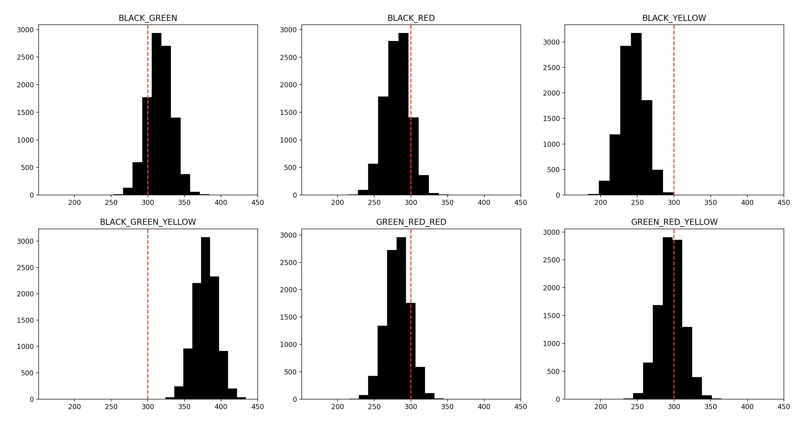

# Koala project

### Objectives:

* learn drift rates of polls
* Create Monte-Carlo samples of party results  
* Deliver coalition forecast for German 2021 election
* Deliver 5% hurdle forecast 

### Data to consider

Polls: 
* Allensbach
* Forsa
* FGW
* GMS
* Infratest dimap
* INSA
* Kantar
* Yougov

